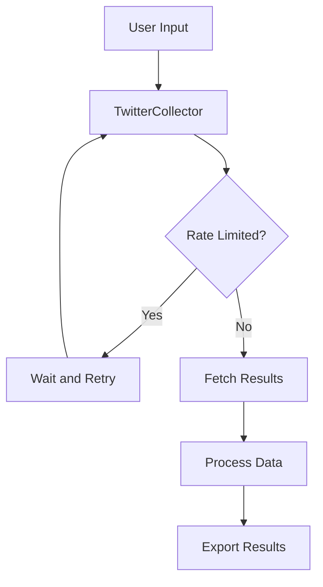

# 9.4 Automated Documentation with MkDocs

Comprehensive documentation is essential for OSINT tools, especially when sharing them with colleagues or the community. This lesson shows how to generate a professional documentation website from Markdown files using MkDocs and deploy it to GitHub Pages with minimal effort.

## Why Good Documentation Matters

For OSINT tools, quality documentation is particularly important because:

1. **Knowledge transfer** - Team members need to understand how to use your tools
2. **Reproducibility** - Investigation steps should be clearly documented
3. **Onboarding** - New team members can get up to speed quickly
4. **Adoption** - Others are more likely to use well-documented tools
5. **Maintenance** - Future you will thank past you for good documentation

## Introduction to MkDocs

[MkDocs](https://www.mkdocs.org/) is a fast, simple documentation generator that builds static HTML sites from Markdown files. It's particularly well-suited for OSINT tool documentation because:

- Markdown is easy to write and read
- The generated site is searchable
- It supports code syntax highlighting
- Its themes are responsive and modern
- GitHub Pages integration is seamless

## Setting Up MkDocs

### Installation

Install MkDocs and the recommended Material theme:

```bash
pip install mkdocs mkdocs-material
```

Adding these to your project's development dependencies:

```toml
# In pyproject.toml
[project.optional-dependencies]
docs = [
    "mkdocs>=1.4.0",
    "mkdocs-material>=8.5.0",
]
```

### Project Initialization

Create a new MkDocs project:

```bash
# Navigate to your project root
cd osint-toolkit

# Initialize MkDocs
mkdocs new .
```

This creates a basic structure:

```
osint-toolkit/
├── docs/
│   └── index.md     # Home page
└── mkdocs.yml       # Configuration file
```

## Configuring MkDocs

Edit the `mkdocs.yml` file to customize your documentation:

```yaml
# Basic site information
site_name: OSINT Toolkit
site_description: Documentation for OSINT Toolkit
site_author: Your Name
site_url: https://yourusername.github.io/osint-toolkit/

# Repository information
repo_name: yourusername/osint-toolkit
repo_url: https://github.com/yourusername/osint-toolkit
edit_uri: edit/main/docs/

# Copyright information
copyright: Copyright &copy; 2023 Your Name

# Theme configuration
theme:
  name: material
  palette:
    primary: indigo
    accent: indigo
  features:
    - navigation.instant
    - navigation.tracking
    - navigation.expand
    - navigation.indexes
    - content.code.annotate
  icon:
    repo: fontawesome/brands/github

# Extensions
markdown_extensions:
  - admonition
  - codehilite
  - pymdownx.highlight:
      anchor_linenums: true
  - pymdownx.superfences
  - pymdownx.inlinehilite
  - pymdownx.tabbed:
      alternate_style: true
  - pymdownx.snippets
  - toc:
      permalink: true

# Navigation structure
nav:
  - Home: index.md
  - Installation: installation.md
  - Usage:
    - Getting Started: usage/getting-started.md
    - Command Line Interface: usage/cli.md
    - API Reference: usage/api-reference.md
  - Tutorials:
    - Twitter Data Collection: tutorials/twitter.md
    - Data Analysis: tutorials/analysis.md
  - Development:
    - Contributing: development/contributing.md
    - Code of Conduct: development/code-of-conduct.md
  - About:
    - License: about/license.md
    - Changelog: about/changelog.md
```

### Understanding Key Configuration Options

- **site_name**: Your documentation site's title
- **repo_url**: Link to your GitHub repository
- **theme**: Appearance settings (Material theme is highly recommended)
- **markdown_extensions**: Add features like code highlighting and admonitions
- **nav**: Define your documentation structure

## Creating Documentation Content

With MkDocs, you write documentation pages in Markdown format.

### Creating the Home Page

Edit `docs/index.md` to create an inviting home page:

```markdown
# OSINT Toolkit Documentation

Welcome to the documentation for OSINT Toolkit, a Python package for open source intelligence collection and analysis.

## Features

- **Social Media Collection** - Gather data from Twitter, Reddit, and other platforms
- **Data Analysis** - Extract entities, relationships, and insights
- **Visualization** - Generate network graphs and geographical maps
- **Export Options** - Save results in various formats (CSV, JSON, SQLite)

## Quick Start

Install the package:

```bash
pip install osint-toolkit
```

Basic usage:

```python
from osint_toolkit import TwitterCollector

# Initialize collector
collector = TwitterCollector()

# Search for tweets
results = collector.search("cybersecurity", limit=100)

# Process results
for tweet in results:
    print(f"{tweet['date']} - {tweet['user']}: {tweet['text']}")
```

## Documentation Structure

- **[Installation](installation.md)** - Detailed installation instructions
- **[Usage](usage/getting-started.md)** - How to use the toolkit
- **[Tutorials](tutorials/twitter.md)** - Step-by-step guides
- **[API Reference](usage/api-reference.md)** - Detailed function and class documentation
- **[Development](development/contributing.md)** - How to contribute to the project
```

### Creating Additional Pages

Create documentation pages for each section defined in your navigation:

```bash
# Create directories
mkdir -p docs/usage docs/tutorials docs/development docs/about

# Create files
touch docs/installation.md
touch docs/usage/getting-started.md
touch docs/usage/cli.md
touch docs/usage/api-reference.md
touch docs/tutorials/twitter.md
touch docs/tutorials/analysis.md
touch docs/development/contributing.md
touch docs/development/code-of-conduct.md
touch docs/about/license.md
touch docs/about/changelog.md
```

### Using Admonitions for Important Information

Admonitions (special callout blocks) help highlight important information:

```markdown
!!! note "Note"
    This is a note admonition that draws attention to important information.

!!! warning "API Rate Limits"
    Be careful when collecting data from Twitter. The API has rate limits that
    can temporarily block your access if exceeded.

!!! tip "OSINT Tip"
    When searching for usernames, try common variations and misspellings.
```

These render as highlighted boxes in the documentation.

### Code Examples with Syntax Highlighting

Include code examples with proper syntax highlighting:

````markdown
```python
# Search for tweets mentioning a specific username
from osint_toolkit import TwitterCollector

collector = TwitterCollector()
results = collector.search_user_mentions("target_username", days=7)

# Export results to CSV
collector.export_results(results, "mentions.csv")
```
````

### Adding API Documentation

For API reference pages, document each function and class:

````markdown
# API Reference

## TwitterCollector

The `TwitterCollector` class provides methods for gathering data from Twitter.

```python
from osint_toolkit import TwitterCollector

collector = TwitterCollector(api_key=None, api_secret=None)
```

### Parameters

- `api_key` (str, optional): Twitter API key. If not provided, reads from the `TWITTER_API_KEY` environment variable.
- `api_secret` (str, optional): Twitter API secret. If not provided, reads from the `TWITTER_API_SECRET` environment variable.

### Methods

#### search(query, limit=100, language="en")

Searches for tweets matching the query string.

##### Parameters

- `query` (str): Search query string
- `limit` (int, optional): Maximum number of results to return. Defaults to 100.
- `language` (str, optional): Language code. Defaults to "en" (English).

##### Returns

- List of dictionaries, each representing a tweet.

##### Example

```python
results = collector.search("osint tools", limit=50)
```
````

## Generating Documentation Locally

To preview your documentation site:

```bash
# Start the MkDocs development server
mkdocs serve
```

This starts a local server at http://127.0.0.1:8000/ where you can preview your site.

The development server automatically rebuilds the site when you change documentation files, so you can see changes immediately.

## Enhancing Documentation with Images and Diagrams

### Adding Images

Place images in a dedicated directory:

```bash
mkdir -p docs/assets/images
```

Reference them in your Markdown:

```markdown

```

### Adding Diagrams with Mermaid.js

The Material theme supports Mermaid.js for diagrams. Enable it in `mkdocs.yml`:

```yaml
markdown_extensions:
  # ... other extensions
  - pymdownx.superfences:
      custom_fences:
        - name: mermaid
          class: mermaid
          format: !!python/name:pymdownx.superfences.fence_code_format
```

Now you can include diagrams in your documentation:

````markdown

````

This creates a flowchart showing your tool's data collection process.

## Automatic API Documentation

For larger projects, consider adding automatic API documentation generation:

1. Install `mkdocstrings`:
   ```bash
   pip install mkdocstrings[python]
   ```

2. Update `mkdocs.yml`:
   ```yaml
   plugins:
     - search
     - mkdocstrings:
         handlers:
           python:
             selection:
               docstring_style: google
             rendering:
               show_source: true
   ```

3. Reference your code in documentation:
   ````markdown
   # API Reference

   ::: osint_toolkit.collector.TwitterCollector
       options:
         show_root_heading: true
         show_source: true
   ````

This extracts documentation directly from your docstrings.

## Deploying to GitHub Pages

GitHub Pages provides free hosting for your documentation site.

### Manual Deployment

To deploy your site manually:

```bash
# Build the site
mkdocs build

# Deploy to GitHub Pages
mkdocs gh-deploy
```

This:
1. Builds your site to a temporary directory
2. Commits it to the `gh-pages` branch of your repository
3. Pushes the changes to GitHub

Your site will be available at `https://yourusername.github.io/osint-toolkit/`.

### Automated Deployment with GitHub Actions

For automated deployment when your documentation changes, create a GitHub Actions workflow:

1. Create a workflow file:
   ```bash
   mkdir -p .github/workflows
   touch .github/workflows/documentation.yml
   ```

2. Add the workflow configuration:
   ```yaml
   name: Documentation

   on:
     push:
       branches:
         - main
       paths:
         - 'docs/**'
         - 'mkdocs.yml'

   jobs:
     deploy:
       runs-on: ubuntu-latest
       steps:
         - uses: actions/checkout@v3
           with:
             fetch-depth: 0
         
         - name: Set up Python
           uses: actions/setup-python@v4
           with:
             python-version: '3.10'
         
         - name: Install dependencies
           run: |
             python -m pip install --upgrade pip
             pip install mkdocs-material mkdocstrings[python]
         
         - name: Deploy documentation
           run: mkdocs gh-deploy --force
   ```

This workflow automatically deploys your documentation whenever you update the `docs/` directory or `mkdocs.yml` file.

## OSINT-Specific Documentation Considerations

When documenting OSINT tools, include these special sections:

### 1. Ethical and Legal Guidelines

Create a dedicated page for ethical considerations:

```markdown
# Ethical Guidelines

This tool is provided for legitimate OSINT research purposes. When using this toolkit, please adhere to the following guidelines:

- Always comply with applicable laws and regulations
- Respect terms of service for data sources
- Consider privacy implications of data collection
- Use rate limiting to avoid service disruption
- Do not use for harassment or surveillance
- Properly secure and dispose of collected data
```

### 2. Data Source Limitations

Document limitations for each data source:

```markdown
# Twitter Data Collection

## API Limitations

- **Rate limits**: 450 requests per 15-minute window
- **Search history**: Limited to approximately 7 days of historical data
- **Result completeness**: Not all tweets matching criteria are returned
- **Media access**: Some media may require authentication
```

### 3. Operational Security Practices

Include information about operational security when using your tools:

```markdown
# Operational Security

When conducting OSINT investigations using this toolkit:

- Consider using a dedicated research machine
- Use appropriate network security measures (VPN, etc.)
- Be aware of digital fingerprinting in API requests
- Keep local data encrypted when possible
- Regularly update the toolkit for security fixes
```

## Including the Documentation in Your Package

For the best user experience, include the documentation in your Python package:

```toml
# In pyproject.toml
[tool.setuptools.package-data]
"osint_toolkit" = ["docs/**/*.md", "docs/**/*.png"]
```

Then users can access it locally:

```python
import osint_toolkit
import webbrowser
import os

# Get the path to the documentation
docs_path = os.path.join(os.path.dirname(osint_toolkit.__file__), "docs", "index.html")

# Open the documentation in a browser
webbrowser.open(f"file://{docs_path}")
```

## Best Practices for OSINT Tool Documentation

1. **Include practical examples** - Show real-world usage scenarios
2. **Document limitations** - Be clear about what your tool can and cannot do
3. **Update for API changes** - Note when external services change
4. **Version documentation with code** - Keep docs in sync with releases
5. **Provide troubleshooting guides** - Help users solve common problems
6. **Add attribution requirements** - How to properly credit your tool
7. **Include security advisories** - Document security considerations

## Next Steps

With your documentation set up, you've completed the advanced topics in this course. You now have the skills to create well-structured OSINT tools, manage dependencies, package and distribute your code, and create professional documentation.

The next section will provide a curated reading list, community resources, and a roadmap for continuing your OSINT development journey.
